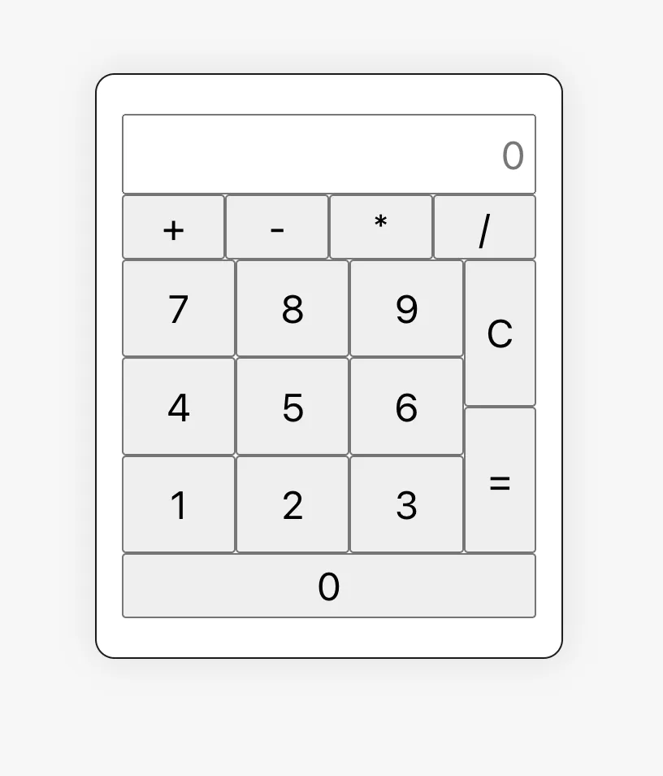

# Calculator

This is a basic calculator that allows users to perform simple math ops such as addition, subtraction, multiplication, and division. Used Vue js.

## Previews



## Conclusion

This calculator is crazy basic, it'll except a mix of button clicks and keyboard presses for number/operational inputs.

## Project Setup

```sh
npm install
```

### Compile and Hot-Reload for Development

```sh
npm run dev
```

### Compile and Minify for Production

```sh
npm run build
```
