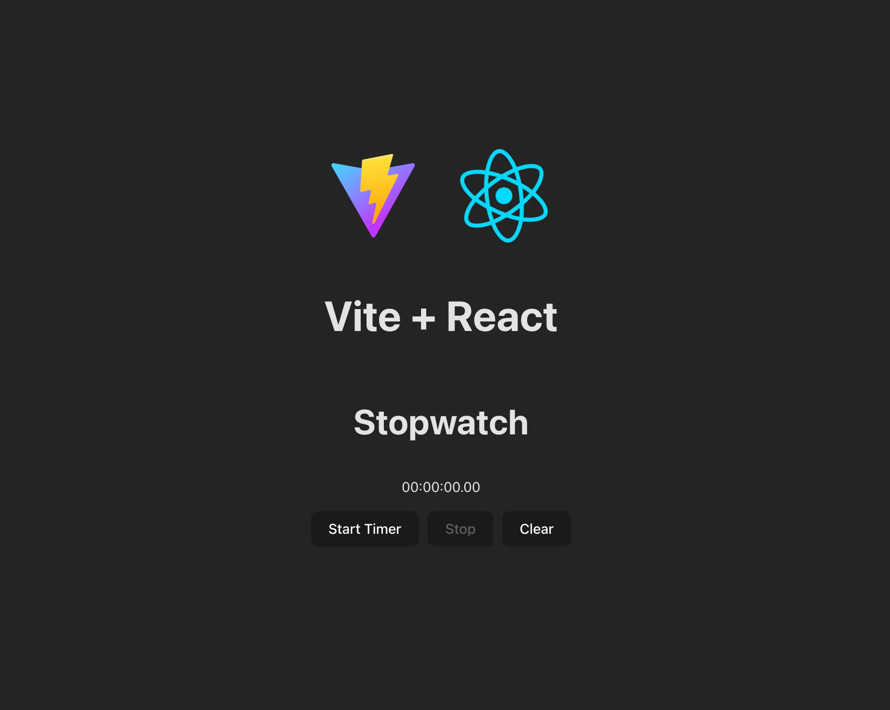

# Stopwatch

This is a basic stopwatch. Used React and Vite. [View it live](https://steves-stopwatch-react.netlify.app/)

## Previews



## Conclusion

Basic stopwatch. I'd still use my iPhone's stopwatch, personally.

## Project Setup

```sh
npm install
```

### Compile and Hot-Reload for Development

```sh
npm run dev
```

### Compile and Minify for Production

```sh
npm run build
```
